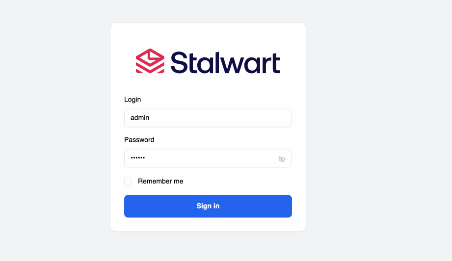

    

<h3 align="center">
  Secure & Modern All-in-One Mail Server (IMAP, JMAP, POP3, SMTP) 🛡️
</h3>

 

  
  &nbsp;
  
  &nbsp;
  

  
  &nbsp;
  

  
  &nbsp;
  

## Features

**Stalwart Mail Server** is an open-source mail server solution with JMAP, IMAP4, POP3, and SMTP support and a wide range of modern features. It is written in Rust and designed to be secure, fast, robust and scalable.

Key features:

- **JMAP** server:
  - [JMAP Core](https://datatracker.ietf.org/doc/html/rfc8620) and [JMAP Mail](https://datatracker.ietf.org/doc/html/rfc8621) full compliance.
  - [JMAP for Sieve Scripts](https://www.ietf.org/archive/id/draft-ietf-jmap-sieve-22.html) extension for managing Sieve scripts.
  - [JMAP for WebSocket](https://datatracker.ietf.org/doc/html/rfc8887), [JMAP Blob Management](https://www.rfc-editor.org/rfc/rfc9404.html) and [JMAP for Quotas](https://www.rfc-editor.org/rfc/rfc9425.html) extensions.
- **IMAP4**, **POP3** and **ManageSieve** server:
  - [IMAP4rev2](https://datatracker.ietf.org/doc/html/rfc9051) and [IMAP4rev1](https://datatracker.ietf.org/doc/html/rfc3501) server with support for [numerous extensions](https://stalw.art/docs/development/rfcs#imap4-and-extensions).
  - [POP3](https://datatracker.ietf.org/doc/html/rfc1939) server with [extensions](https://datatracker.ietf.org/doc/html/rfc2449), [STLS](https://datatracker.ietf.org/doc/html/rfc2595) and [SASL](https://datatracker.ietf.org/doc/html/rfc5034) support.
  - [ManageSieve](https://datatracker.ietf.org/doc/html/rfc5804) server for managing Sieve scripts.
- **SMTP** server:
  - Built-in [DMARC](https://datatracker.ietf.org/doc/html/rfc7489), [DKIM](https://datatracker.ietf.org/doc/html/rfc6376), [SPF](https://datatracker.ietf.org/doc/html/rfc7208) and [ARC](https://datatracker.ietf.org/doc/html/rfc8617) support for message authentication.
  - Strong transport security through [DANE](https://datatracker.ietf.org/doc/html/rfc6698), [MTA-STS](https://datatracker.ietf.org/doc/html/rfc8461) and [SMTP TLS](https://datatracker.ietf.org/doc/html/rfc8460) reporting.
  - Inbound throttling and filtering with granular configuration rules, sieve scripting, MTA hooks and milter integration.
  - Distributed virtual queues with delayed delivery, priority delivery, quotas, routing rules and throttling support.
  - Envelope rewriting and message modification.
- **Spam Phishing** filter:
  - Comprehensive set of filtering **rules** on par with popular solutions.
  - Statistical **spam classifier** with automatic training capabilities.
  - DNS Blocklists (**DNSBLs**) checking of IP addresses, domains, and hashes.
  - Collaborative digest-based spam filtering with **Pyzor**.
  - **Phishing** protection against homographic URL attacks, sender spoofing and other techniques.
  - Trusted **reply** tracking to recognize and prioritize genuine e-mail replies.
  - Sender **reputation** monitoring by IP address, ASN, domain and email address.
  - **Greylisting** to temporarily defer unknown senders.
  - **Spam traps** to set up decoy email addresses that catch and analyze spam.
- **Flexible and scalable**:
  - Pluggable storage backends with **RocksDB**, **FoundationDB**, **PostgreSQL**, **mySQL**, **SQLite**, **S3-Compatible**, **Redis** and **ElasticSearch** support.
  - **Clustering** support with node autodiscovery and partition-tolerant failure detection.
  - Built-in, **LDAP** or **SQL** authentication backend support.
  - Full-text search available in 17 languages.
  - Sieve scripting language with support for all [registered extensions](https://www.iana.org/assignments/sieve-extensions/sieve-extensions.xhtml).
  - Email aliases, mailing lists, subaddressing and catch-all addresses support.
  - Automatic account configuration and discovery with [autoconfig](https://www.ietf.org/id/draft-bucksch-autoconfig-02.html) and [autodiscover](https://learn.microsoft.com/en-us/exchange/architecture/client-access/autodiscover?view=exchserver-2019). 
  - Integration with **OpenTelemetry** to enable monitoring, tracing, and performance analysis.
  - Webhooks for event-driven automation.
  - Disk quotas.
- **Web-based administration**:
  - Account, domain, group and mailing list management.
  - SMTP queue management for messages and outbound DMARC and TLS reports.
  - Report visualization interface for received DMARC, TLS-RPT and Failure (ARF) reports.
  - Configuration of every aspect of the mail server.
  - Log viewer with search and filtering capabilities.
  - Self-service portal for password reset and encryption-at-rest key management.
- **Secure and robust**:
  - Encryption at rest with **S/MIME** or **OpenPGP**.
  - Automatic TLS certificate provisioning with [ACME](https://datatracker.ietf.org/doc/html/rfc8555) using `TLS-ALPN-01`, `DNS-01` or `HTTP-01` challenges.
  - OAuth 2.0 [authorization code](https://www.rfc-editor.org/rfc/rfc8628) and [device authorization](https://www.rfc-editor.org/rfc/rfc8628) flows.
  - Automated blocking of hosts that cause multiple authentication errors (aka **fail2ban**).
  - Access Control Lists (ACLs).
  - Rate limiting.
  - Security audited (read the [report](https://stalw.art/blog/security-audit)).
  - Memory safe (thanks to Rust).

## Screenshots

## Get Started

Install Stalwart Mail Server on your server by following the instructions for your platform:

- [Linux / MacOS](https://stalw.art/docs/install/linux)
- [Windows](https://stalw.art/docs/install/windows)
- [Docker](https://stalw.art/docs/install/docker)

All documentation is available at [stalw.art/docs/get-started](https://stalw.art/docs/get-started).

## Support

If you are having problems running Stalwart Mail Server, you found a bug or just have a question,
do not hesitate to reach us on [Github Discussions](https://github.com/stalwartlabs/mail-server/discussions),
[Reddit](https://www.reddit.com/r/stalwartlabs), [Discord](https://discord.gg/aVQr3jF8jd) or [Matrix](https://matrix.to/#/#stalwart:matrix.org).
Additionally you may become a sponsor to obtain priority support from Stalwart Labs Ltd.

## Roadmap

- [ ] JMAP Calendar, Contacts and Tasks support
- [ ] CalDAV and CardDAV support
- [ ] ActiveSync support

See the [open issues](https://github.com/stalwartlabs/mail-server/issues) for a full list of proposed features (and known issues).

## Funding

Part of the development of this project was funded through the [NGI0 Entrust Fund](https://nlnet.nl/entrust), a fund established by [NLnet](https://nlnet.nl/) with financial support from the European Commission's [Next Generation Internet](https://ngi.eu/) programme, under the aegis of DG Communications Networks, Content and Technology under grant agreement No 101069594.

If you find the project useful you can help by [becoming a sponsor](https://liberapay.com/stalwartlabs). Thank you!

## License

This project is dual-licensed under the **GNU Affero General Public License v3.0** (AGPL-3.0; as published by the Free Software Foundation) and the **Stalwart Enterprise License v1 (SELv1)**:

- The [GNU Affero General Public License v3.0](./LICENSES/AGPL-3.0-only.txt) is a free software license that ensures your freedom to use, modify, and distribute the software, with the condition that any modified versions of the software must also be distributed under the same license. 
- The [Stalwart Enterprise License v1 (SELv1)](./LICENSES/LicenseRef-SEL.txt) is a proprietary license designed for commercial use. It offers additional features and greater flexibility for businesses that do not wish to comply with the AGPL-3.0 license requirements. 

Each file in this project contains a license notice at the top, indicating the applicable license(s). The license notice follows the [REUSE guidelines](https://reuse.software/) to ensure clarity and consistency. The full text of each license is available in the [LICENSES](./LICENSES/) directory.

## Copyright

Copyright (C) 2024, Stalwart Labs Ltd.
